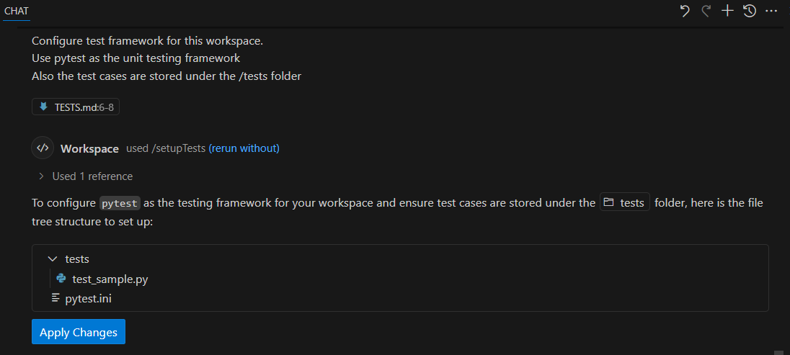
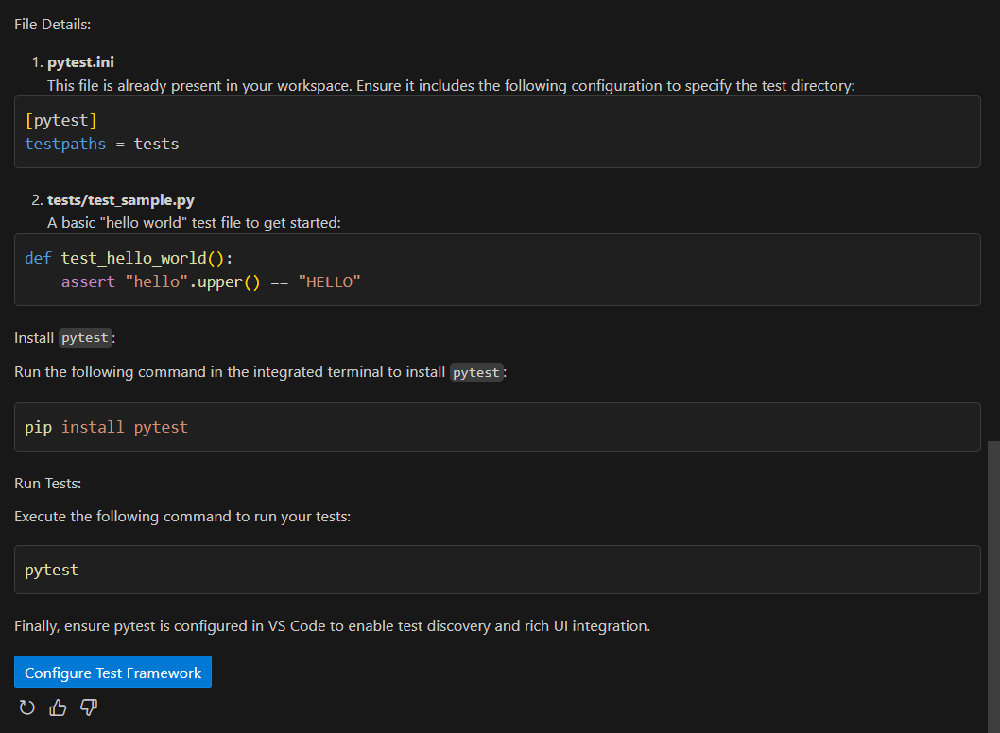
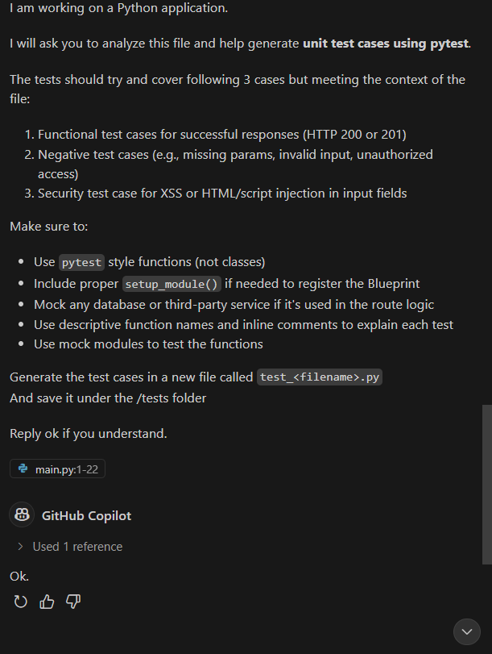

# Generate Test Case with Github Copilot

```
## Configure Test Framework

Configure test framework for this workspace.
Use pytest as the unit testing framework
Also the test cases are stored under the /tests folder

## Configure Unit Testing

I am working on a Python application. 

I will ask you to analyze this file and help generate **unit test cases using pytest**.

The tests should try and cover following 3 cases but meeting the context of the file:
1. Functional test cases for successful responses (HTTP 200 or 201) 
2. Negative test cases (e.g., missing params, invalid input, unauthorized access) 
3. Security test case for XSS or HTML/script injection in input fields 

Make sure to:
- Use `pytest` style functions (not classes)
- Include proper `setup_module()` if needed to register the Blueprint
- Mock any database or third-party service if it's used in the route logic
- Use descriptive function names and inline comments to explain each test
- Use mock modules to test the functions

Generate the test cases in a new file called `test_<filename>.py`
And save it under the /tests folder

Reply ok if you understand.
```

# Sample Screens







